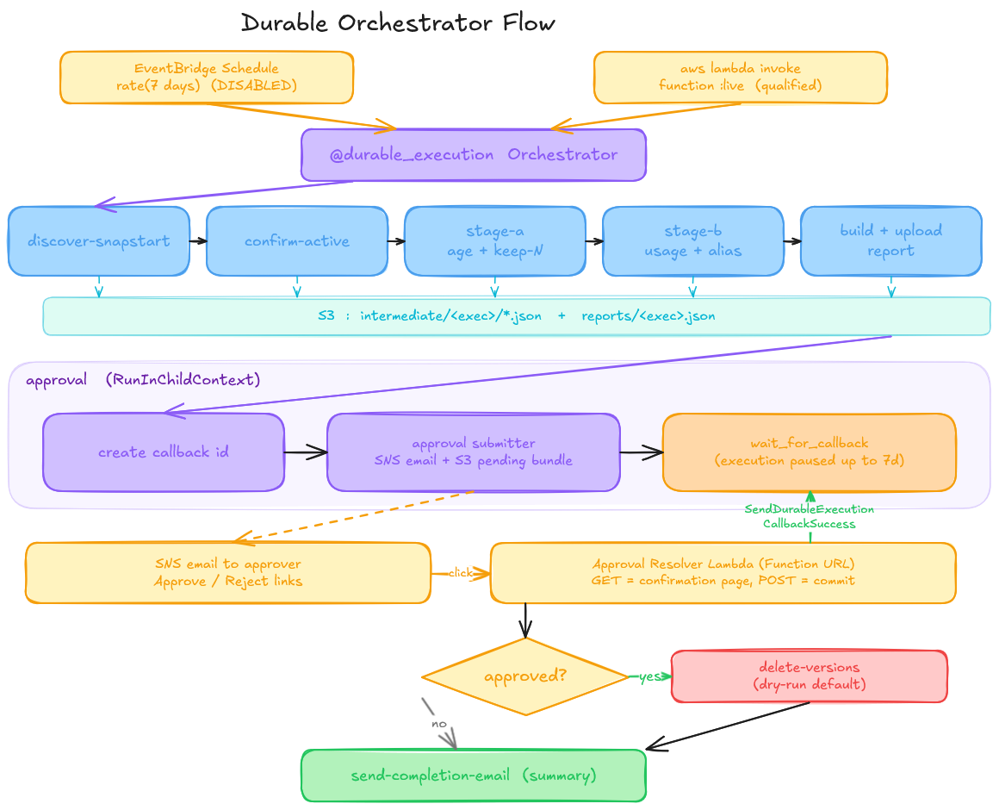

# AWS Lambda SnapStart Version Cleaner

Scans a region for SnapStart-enabled published Lambda versions, classifies
each as a deletion candidate using a two-stage safety check (age + usage),
sends an email with one-click **Approve / Reject** links, and only deletes
after explicit human approval.

Because SnapStart-enabled published versions incur snapshot-cache charges for
as long as they exist, and Python SnapStart has no "make this version
inactive" control, the practical way to stop paying for an unused version is
to delete it. This project finds those candidates safely.

The cleanup pipeline runs as a **Lambda Durable Function** so the human
approval wait (up to 7 days) lives inside the execution's state machine,
with every phase visible as a separate step in the Durable Operations panel.

## Orchestrator flow (at a glance)



Editable source: [`docs/orchestrator-flow.excalidraw`](docs/orchestrator-flow.excalidraw)
· open online on [excalidraw.com](https://excalidraw.com/#json=CDqVvDOb-POU3Dpk_3viJ,PqBt2vMAoEvMaPy2rNMtAw).

The remaining sections of this README annotate that diagram in text form.

## Repo layout

```
aws-lambda-version-cleaner/
├── README.md
├── .gitignore
├── template.yaml        # SAM template (orchestrator + approval + weekly schedule)
├── docs/
│   └── orchestrator-flow.excalidraw  # editable source for the flow diagram above
├── events/
│   ├── scan.json        # starter orchestrator payload
│   └── approve.json     # local-only callback payload for sam local
└── src/                 # SAM CodeUri -- this is the whole Lambda bundle
    ├── requirements.txt # boto3 + aws-durable-execution-sdk-python
    ├── orchestrator.py      # @durable_execution handler
    ├── approval_resolver.py # Function URL handler for the email links
    └── steps.py             # pure-Python step functions used by the orchestrator
```

## Two-stage deletion candidacy

A version is marked `candidate_for_deletion=true` only when **both** stages
pass.

### Stage A — age + keep-last-N (cheap pre-filter)

- `LastModified` older than `min_age_days` (default **14**)
- **and** version is not among the newest `keep_last_n` versions of its
  function (default **3**)

### Stage B — usage + alias protection

- Not referenced by any alias
  (`ListAliases` primary + `RoutingConfig.AdditionalVersionWeights`)
- **and** no CloudWatch `Invocations` activity on
  `Resource = <fn>:<ver>` in the lookback window
- **and** the function-level CloudWatch fallback
  (`FunctionName = <fn>`) is either empty or older than `min_age_days`

The function-level fallback catches accounts where callers invoke the
*unqualified* function ARN. In that case CloudWatch publishes only
`FunctionName`-dimension metrics — not `Resource`-dimension ones — and a
Stage B check that relies solely on per-qualifier timeseries would miss the
activity signal entirely. Both signals appear on every row so a reviewer can
see exactly what fired.

Each row carries `reason_flags` so it's obvious why a version was (or was
not) a candidate:

| flag | meaning |
| --- | --- |
| `too_recent` | `age_days < min_age_days` |
| `protected_kept_last_n` | version is among newest N for its function |
| `alias_protected` | any alias references this version |
| `has_recent_invocations` | per-qualifier CW activity in lookback |
| `function_level_activity_uncertain` | per-qualifier empty but function-level shows recent activity |
| `no_activity_and_stale` | Stage A and Stage B both pass |

## Deploy

### Prerequisites

- AWS SAM CLI (`sam --version`)
- Python **3.13** on `PATH` (matches the Lambda runtime; the SAM bundler
  needs it to resolve the durable-execution SDK)
- AWS credentials with stack-creation permission

### One-command deploy

```bash
sam build
sam deploy --guided \
  --stack-name snapstart-version-cleaner \
  --capabilities CAPABILITY_IAM \
  --parameter-overrides \
    TargetRegion=us-west-2 \
    ApproverEmail=you@example.com \
    DeleteDryRun=true \
    WeeklyScheduleState=DISABLED
```

Stack parameters:

| Parameter | Default | Description |
| --- | --- | --- |
| `TargetRegion` | `us-west-2` | Region the orchestrator scans |
| `ApproverEmail` | *required* | Email that receives approval notifications |
| `DeleteDryRun` | `true` | `true` = log would-be deletions, `false` = actually call `lambda:DeleteFunction` |
| `WeeklyScheduleState` | `DISABLED` | `ENABLED` to let the weekly cron fire automatic scans |

After `sam deploy` finishes:

1. **Confirm the SNS subscription email.** No messages arrive until the
   approver clicks the "Confirm subscription" link that AWS sends.
2. **First run stays in dry-run.** Let `DeleteDryRun=true` drive one full
   end-to-end cycle before flipping to `false`.
3. The weekly schedule is created but **disabled by default**. Flip it on
   with `--parameter-overrides "... WeeklyScheduleState=ENABLED"` once
   you've validated the flow.

### Stack outputs

| Output | Use |
| --- | --- |
| `OrchestratorFunctionName` | function name (informational) |
| `OrchestratorFunctionArn` | unqualified ARN (informational) |
| `OrchestratorAliasArn` | **qualified** ARN of the `live` alias — use this for manual `aws lambda invoke` |
| `ApprovalTopicArn` | `aws sns subscribe` to add more approvers |
| `ApprovalBundleBucketName` | audit the pending callbacks / scan reports |
| `ApprovalResolverUrl` | the HTTPS endpoint that backs the email links |
| `WeeklyScanScheduleName` | EventBridge Scheduler resource name |

### Trigger a scan manually

Durable executions must be invoked **asynchronously** (the 7-day execution
timeout exceeds Lambda's 15-minute sync cap) and **against a qualified ARN**
(Lambda rejects durable invokes against `$LATEST` or an unqualified name).
The stack publishes a `live` alias on every deploy — use it:

```bash
aws lambda invoke \
  --region us-west-2 \
  --function-name snapstart-version-cleaner-orchestrator:live \
  --invocation-type Event \
  --cli-binary-format raw-in-base64-out \
  --payload file://events/scan.json \
  /tmp/out.json
```

The weekly EventBridge schedule is already wired to the alias automatically
(via `AutoPublishAlias: live` in `template.yaml`), so scheduled runs and
manual runs exercise the exact same Lambda version.

`StatusCode: 202` means the execution started. Watch it progress in the
Lambda console's **Durable Operations** panel or with:

```bash
aws lambda list-durable-executions-by-function \
  --region us-west-2 \
  --function-name snapstart-version-cleaner-orchestrator
```

### Add more approvers

```bash
aws sns subscribe \
  --topic-arn <ApprovalTopicArn> \
  --protocol email \
  --notification-endpoint another@example.com
```

Each new subscriber must also confirm the subscription email.

## Durable orchestration — phase map

Every phase is a separate `context.step(...)` / `context.wait_for_callback(...)`
call, so the Durable Operations panel shows each as its own row with its own
duration. Intermediate bulky row lists are offloaded to S3 so per-phase
checkpoints stay under Lambda's 256 KiB limit.

```
discover-snapstart          # ListFunctions, keep SnapStart=On rows
  └─▶ intermediate/<exec>/01-snapstart.json
confirm-active              # GetFunctionConfiguration per version, keep State=Active
  └─▶ intermediate/<exec>/02-active.json
stage-a-age-and-keep-last-n # annotate age_days + is_among_keep_last_n
  └─▶ intermediate/<exec>/03-stage-a.json
stage-b-usage-and-alias     # CloudWatch invocations + alias protection
  └─▶ intermediate/<exec>/04-stage-b.json
build-and-upload-report     # final report dict
  └─▶ reports/<exec>.json                ← retained 30d, audit trail

approval  (RunInChildContext)
  ├─ approval create callback id         # durable SDK mints the callback token
  └─ approval submitter                  # uploads pending bundle + sends SNS email
                                         # ... orchestrator parks here ...
                                         # ... reviewer clicks Approve/Reject ...
CallbackSucceeded

delete-versions             # lambda:DeleteFunction per approved row (dry-run by default)
send-completion-email       # summary email: deletions / errors / rejects / timeouts
```

### Approval email round-trip

1. Orchestrator writes the pending candidate list to
   `s3://<ApprovalBundleBucket>/pending-callbacks/<callback_id>.json` and
   publishes a plain-text SNS email containing two hyperlinks:
   `<ApprovalResolverUrl>/approve?cb=<id>` and `/reject?cb=<id>`.
2. Reviewer clicks a link. The resolver renders a **confirmation page** with
   a `[Confirm]` button — no side effects yet. This split exists because
   corporate email security (Outlook Safe Links, Gmail, etc.) GET-prefetches
   inbound links to scan for malware; a GET that consumed the one-shot
   token would burn it on the scanner and leave the human's browser
   looking at an "expired" page.
3. Reviewer clicks `[Confirm]`. The browser POSTs to the resolver, which
   calls `lambda:SendDurableExecutionCallbackSuccess`, deletes the S3 bundle
   (so the link can't be replayed), and shows the success page.
4. Orchestrator resumes, branches on `approved`, and either runs
   `delete-versions` + `send-completion-email` ("done") or skips straight
   to the rejection/timeout notification.

## Weekly schedule

`AWS::Scheduler::Schedule` (EventBridge Scheduler, created by SAM's
`ScheduleV2` event type) invokes the orchestrator asynchronously every 7
days with a JSON payload matching `events/scan.json`.

Controls:

- **Pause**: redeploy with `WeeklyScheduleState=DISABLED` (this is the
  default on a fresh stack).
- **Resume**: redeploy with `WeeklyScheduleState=ENABLED`.
- **Change cadence**: edit `ScheduleExpression: rate(7 days)` in
  `template.yaml` (accepts `rate(...)` or `cron(...)`).
- **Concurrency**: if a prior week's approval is still open when the next
  tick fires, two durable executions run side by side — each with its own
  callback ID and email. Add a "RUNNING execution already exists?"
  early-return in `orchestrator.py` if that's undesirable.

## Local run (no deploy)

When the approval env vars are unset, `step6_send_approval_notification`
falls back to log-only mode: it prints the `callback_id` to stderr and
suspends the wait. You resolve it manually:

```bash
sam build
sam local invoke VersionCleanerOrchestrator -e events/scan.json

# grab the callback id from stderr, then:
sam local execution history
sam local callback succeed <execution-id> <callback-id> \
  --payload "$(cat events/approve.json)"
# simulate reject
sam local callback succeed <execution-id> <callback-id> --payload '{"approved": false}'
```

## Notes on CloudWatch accuracy

- Lambda publishes CloudWatch metrics at 1-minute granularity. The default
  `period_seconds=3600` trades precision for a cheaper scan; drop to
  `60` for minute-accurate last-invoked timestamps.
- Datapoint timestamps represent the start of the aggregation bucket, so
  inferred last-invoked times are approximate to within `period_seconds`.
- `Resource`-dimension metrics (`<fn>:<ver>` or `<fn>:<alias>`) are only
  published when callers use qualified ARNs. The function-level fallback
  (`FunctionName=<fn>`) exists specifically for the unqualified-call case.

## Security notes / still-POC

- `DeleteDryRun` defaults to `true`. Flip it to `false` only after
  validating the flow end-to-end in a non-prod account, and consider
  tightening the `lambda:DeleteFunction` IAM resource to a function-name
  prefix at the same time.
- Approval Function URL uses `AuthType: NONE`. The `cb=<callback_id>`
  query-string value is the capability, mitigated by one-shot S3-bundle
  deletion + an 8-day lifecycle rule. Production should switch to
  `AuthType: AWS_IAM` with SigV4-signed links or add HMAC verification
  inside the resolver.
- A durable `wait_for_callback` replay could re-publish a duplicate SNS
  email (SNS `Publish` is not idempotent). Gating the publish on a marker
  key in the bundle bucket is the cleanest fix.
- `lambda:ListEventSourceMappings` is already in the IAM policy so a
  pre-delete safety check (skip versions referenced by any event source
  mapping) can be added to `step7_delete_versions` without a policy
  change.
